  
  
    

  # prozpkt
  
  

    
  

  
  **Penetration Tester • Software Developer • AI Enthusiast**

   

  
  &nbsp;
  
  &nbsp;
  

---

### About Me

## I'm a Software Developer and Penetration tester. I enjoy exploiting websites : )

## • Currently: Building cross-platform mobile applications with React Native.
## • Security Focus: Primarily focused on Penetration Testing, web security, and understanding how systems can be secured.
## • AI Enthusiast: Exploring Artificial Intelligence, experimenting with AI tools, and keeping up with the latest developments in the field.
## • Development: Experienced with React, Next.js, Vite, Kotlin, and React Native.
## • Collaboration: Open to working on interesting security, AI, and software development projects.

---

### Technical Capability & Skills Radar

  

---

### Core Tooling & Technologies

| **Category** | **Technologies** |
| :--- | :--- |
| **Mobile & App Dev** | 

**Web Development** | 

**Backend & Databases** | 

**AI & Python** | 

**Cybersecurity & Pentesting** | 

**Networking** | 

**DevOps & Cloud** | 

**Tools & Platforms** |  /> |

--- 

# Cybersecurity: Penetration Testing · Web Security · API Security · Vulnerability Assessment · Reconnaissance · OWASP · Burp Suite · Nmap · Metasploit · Wireshark · Gobuster · SQLMap

# Networking: TCP/IP · DNS · HTTP/HTTPS · SSH · FTP · DHCP · VPN · Subnetting · Firewalls · Ports & Protocols · Network Scanning · Packet Analysis

# DevOps: Docker · Nginx · CI/CD · GitHub Actions · Linux Administration · Reverse Proxy · Deployment · VPS · Environment Configuration · SSL/TLS

# Tools: Git · GitHub · VS Code · Postman · Wireshark · Burp Suite · Nmap · Metasploit · Figma · Bash · PowerShell · Linux CLI

---

### 📈 Activity & Contribution Flow

  

---

### 🎮 The Human Side

I'm not just a code machine. When the IDE closes, here is who I am:

* **⚔️ Current Obsession:** Hunting monsters in *The Witcher 3: Wild Hunt*.
* **⌚ Tinkering:** I build custom mechanical watches—because debugging tiny gears is just as hard as debugging code.
* **🤖 Philosophy:** I believe in using AI to amplify developer productivity, not replace creativity.

---

  Let's build something incredible together.

